# C4 — Container Diagram

Breaks ClaimPilot into its deployable units and shows which protocol connects each pair: synchronous HTTP (request/response, mostly Claims → Policy and gateway routing) versus asynchronous Kafka events (everything that doesn't need an immediate answer).

```mermaid
C4Container
    title ClaimPilot — Container Diagram

    Person(customer, "Customer")
    Person(adjuster, "Adjuster")

    System_Boundary(claimpilot, "ClaimPilot") {
        Container(portal, "Adjuster Portal", "React + TypeScript", "Claim queue, agent reasoning, approve/reject UI")
        Container(gateway, "API Gateway", "C# / YARP", "Entry point, auth, routing, rate limiting")
        Container(claims, "Claims Service", "C# / ASP.NET Core", "Claim lifecycle, transactional outbox")
        Container(policy, "Policy Service", "C# / ASP.NET Core", "Policies, coverage rules, limits")
        Container(documents, "Document Service", "Python / FastAPI", "Upload, extraction, chunking, embeddings, RAG search")
        Container(agents, "Agent Orchestrator", "C# / Agent Framework", "Intake, Coverage, Fraud, Summary agents; human approval")
        Container(insights, "Insights Service", "C# / Semantic Kernel", "Claim summaries and decision letters via plugins/filters")
        Container(claimsmcp, "claims-mcp", "C#", "MCP tools: get_claim, get_claim_history, update_claim_status")
        Container(docsmcp, "documents-mcp", "Python", "MCP tools: search_policy, get_document")
        Container(notify, "Notification Worker", "C# / Worker Service", "Emails/alerts from Kafka events")
        ContainerDb(pg, "PostgreSQL", "Azure Database for PostgreSQL", "Claims, policy, document-chunk (pgvector) data — database per service")
        Container(kafka, "Kafka", "Apache Kafka (KRaft)", "Event backbone: claims.submitted, claims.decided, etc.")
        ContainerDb(blob, "Blob Storage", "Azure Blob", "Raw document files")
    }

    System_Ext(aifoundry, "Azure AI Foundry", "Chat + embedding models")

    Rel(customer, portal, "Files claim, views status", "HTTPS")
    Rel(adjuster, portal, "Reviews, approves/rejects", "HTTPS")
    Rel(portal, gateway, "API calls, SSE stream", "HTTPS")
    Rel(gateway, claims, "Routes", "HTTP")
    Rel(gateway, documents, "Routes", "HTTP")
    Rel(claims, policy, "Checks coverage", "HTTP")
    Rel(claims, kafka, "Publishes ClaimSubmitted (via outbox)", "Kafka")
    Rel(documents, kafka, "Publishes DocumentsUploaded", "Kafka")
    Rel(kafka, agents, "Triggers Intake/Coverage/Fraud/Summary", "Kafka")
    Rel(kafka, insights, "Triggers decision-letter generation", "Kafka")
    Rel(kafka, notify, "Triggers notifications", "Kafka")
    Rel(agents, claimsmcp, "Tool calls", "MCP / Streamable HTTP")
    Rel(agents, docsmcp, "Tool calls", "MCP / Streamable HTTP")
    Rel(claimsmcp, claims, "Reads/writes claim data", "HTTP")
    Rel(docsmcp, documents, "RAG search", "HTTP")
    Rel(insights, claims, "Reads claim data via SK plugin", "HTTP")
    Rel(insights, policy, "Reads policy data via SK plugin", "HTTP")
    Rel(claims, pg, "Reads/writes", "EF Core / Dapper")
    Rel(policy, pg, "Reads/writes", "EF Core")
    Rel(documents, pg, "Reads/writes chunks + embeddings", "SQLAlchemy / pgvector")
    Rel(documents, blob, "Stores files", "SDK")
    Rel(agents, aifoundry, "Chat completions", "SDK")
    Rel(insights, aifoundry, "Chat completions", "SDK")
    Rel(documents, aifoundry, "Embeddings", "SDK")
```

## One-sentence summary per box

- **Adjuster Portal** — the only UI; everyone (customer and adjuster) goes through it.
- **API Gateway** — the single HTTP front door; nothing reaches a service directly from outside.
- **Claims Service** — owns the claim lifecycle and is the only writer of `claims.submitted`/outbox events.
- **Policy Service** — the sole source of truth for coverage rules; Claims never duplicates this data.
- **Document Service** — the only service that touches raw files and produces embeddings.
- **Agent Orchestrator** — runs the four-agent workflow; talks to data exclusively through MCP tools, never directly to a database.
- **Insights Service** — the Semantic Kernel counterpart to the Agent Framework orchestrator, built deliberately to compare the two approaches.
- **claims-mcp / documents-mcp** — the only doors agents have into claim and document data; this is the enforcement point for "agents never touch databases directly."
- **Notification Worker** — a pure Kafka consumer; it owns no HTTP API.
- **PostgreSQL** — one logical database per service (Claims, Policy, Documents), not one shared schema.
- **Kafka** — the asynchronous backbone connecting everything except the Claims↔Policy coverage check.
- **Blob Storage** — raw file bytes live only here, never in PostgreSQL.
