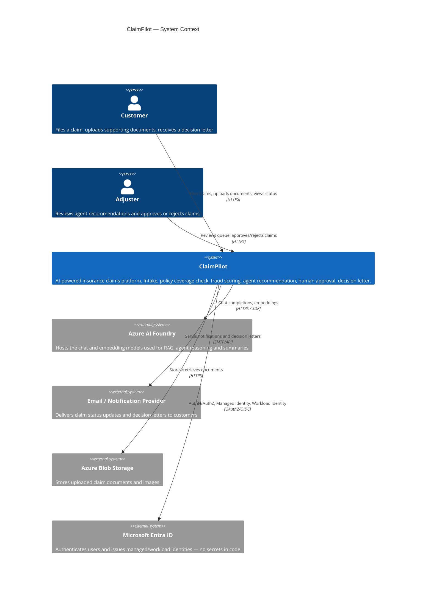

# C4 — Context Diagram

ClaimPilot sits between the people filing/handling claims and the external systems it depends on.

## One-sentence summary per box

- **Customer** — files a claim and supplies documents; the only external actor who doesn't log in as staff.
- **Adjuster** — the human in the loop; makes the final approve/reject call on every agent recommendation.
- **ClaimPilot** — the system being built: nine services behind a gateway, described further in the Container diagram.
- **Azure AI Foundry** — the only source of LLM intelligence; nothing in ClaimPilot calls a model directly without going through it.
- **Email/Notification Provider** — a dumb delivery channel; ClaimPilot never stores notification content there.
- **Azure Blob Storage** — the only place raw claim documents live; the Document Service never persists file bytes in PostgreSQL.
- **Microsoft Entra ID** — every identity in the system (user, pod, service) is issued and verified here; this is why there are no secrets in code.
